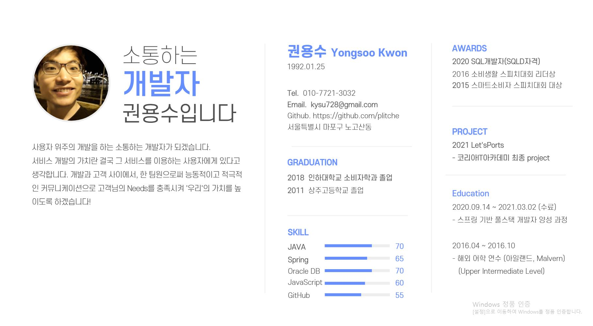

# About Me

<!--author-->

## My simple Profile
<!-- 안녕하세요. 소통하는 개발자 **권용수**입니다.^^ -->
<!-- {:.lead} -->

1. this list will be replaced by the toc
{:toc .large-only}
{:.lead width="1920" height="1080" loading="lazy"}

<!-- Hydejack's cover page on a variety of screen sizes.
{:.figcaption} -->

I'm going to be **Developer** who can **Communicate** with any co-worker and who can persue **User-oriendted.**  

I thought the value of service is in user who use the service. Between develop and customer as one of the team member, i will increase value of **Our service's value** to satisfied user's **needs** with **active communication skills.**

<!-- > Your complete presence on the web — A [blog], [portfolio], and [resume]. -->
{:.lead}

## Personal Information

📅 Born In : 1992.01.25  
📞 Phone : 010-7721-3032  
💌 Email.1 : kysu728@naver.com  
💌 Email.2 : kysu728@gmail.com  
🏠 Address : Mapo-gu Seoul of South-Korea (서울특별시 마포구 노고산동)  

## Education & Certification & Awards
<!--  -->
　**Education**  
* 2020.09 ~ 2021.03 코리아IT아카데미 스프링기반 풀스택 개발자 양성 과정 [수료]
* 2011.03 ~ 2018.02 해외 어학 연수 Malvern in Dublin [Upper Intermediate Level]
* 2011.03 ~ 2018.02 인하대학교 소비자학과 [졸업]
* 2008.03 ~ 2008.02 상주고등학교 인문계열 [졸업]

　**Certification**  
* 2020 SQL개발자(SQLD자격)

　**Awards**  
* 2021 코리아IT아카데미 선행상
* 2016 소비생활 스피치대회 리더상
* 2015 스마트소비자 스피치대회 대상

## Skills
Back-end&nbsp;&nbsp;&nbsp;&nbsp;③Java ②Spring ①Apache  
Database&nbsp;&nbsp;&nbsp;&nbsp;②Oracle  
Front-end&nbsp;&nbsp;&nbsp;③javascript ②HTML/CSS  
etc&nbsp;&nbsp;&nbsp;&nbsp;&nbsp;&nbsp;&nbsp;&nbsp;&nbsp;&nbsp;&nbsp;&nbsp;&nbsp;&nbsp;&nbsp;①Git/Github  

<!--posts-->

## Career
2020.04 ~ 2020.08　　**잡플래닛** / 터닝포인트HR / 대리(프리랜서)  
2019.11 ~ 2020.04　　**시너지컨설팅** / 인재파견부 / 사원  
2018.10 ~ 2019.09　　**Plitche** / 온라인쇼핑몰 / 사장  
2017.08 ~ 2018.09　　**샤넬코리아** / Customer Care Center / 사원  

## Project
2021.02 ~ 2021.03 **Let'sPorts** [Detail] [Github](https://github.com/plitche/LetsPorts)

<!--projects-->
